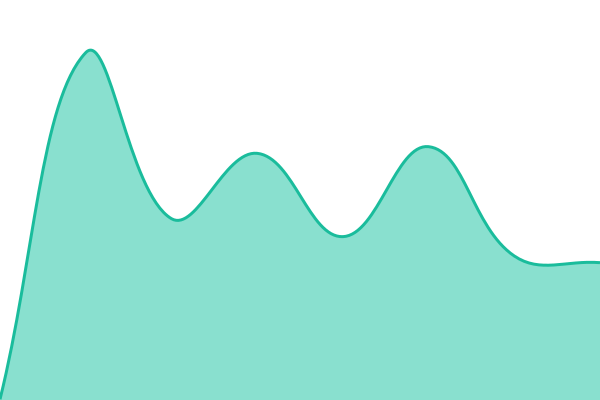
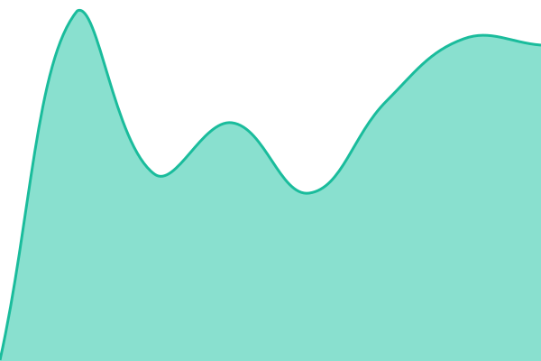

# [📈 Live Status](https://status.kici.dev): <!--live status--> **🟩 All systems operational**

This repository contains the open-source uptime monitor and status page for [KiCI](https://kici.dev), powered by [Upptime](https://github.com/upptime/upptime).

With [Upptime](https://upptime.js.org), you can get your own unlimited and free uptime monitor and status page, powered entirely by a GitHub repository. We use [Issues](https://github.com/kici-dev/status/issues) as incident reports, [Actions](https://github.com/kici-dev/status/actions) as uptime monitors, and [Pages](https://status.kici.dev) for the status page.

<!--start: status pages-->
<!-- This summary is generated by Upptime (https://github.com/upptime/upptime) -->
<!-- Do not edit this manually, your changes will be overwritten -->
<!-- prettier-ignore -->
| URL | Status | History | Response Time | Uptime |
| --- | ------ | ------- | ------------- | ------ |
|  [Platform API](https://api.kici.dev/health) | 🟩 Up | [platform-api.yml](https://github.com/kici-dev/status/commits/HEAD/history/platform-api.yml) | 

 603ms
     
 | 

<a href="https://status.kici.dev/history/platform-api">100.00%</a>
    

|  [Dashboard](https://app.kici.dev) | 🟩 Up | [dashboard.yml](https://github.com/kici-dev/status/commits/HEAD/history/dashboard.yml) | 

 311ms
     
 | 

<a href="https://status.kici.dev/history/dashboard">100.00%</a>
    

|  [Docs](https://docs.kici.dev) | 🟩 Up | [docs.yml](https://github.com/kici-dev/status/commits/HEAD/history/docs.yml) | 

 358ms
     
 | 

<a href="https://status.kici.dev/history/docs">100.00%</a>
    

|  [Auth](https://auth.kici.dev/realms/kici-internal/.well-known/openid-configuration) | 🟩 Up | [auth.yml](https://github.com/kici-dev/status/commits/HEAD/history/auth.yml) | 

 557ms
     
 | 

<a href="https://status.kici.dev/history/auth">100.00%</a>
    

<!--end: status pages-->

[**Visit our status website →**](https://status.kici.dev)

## 📄 License

- Powered by: [Upptime](https://github.com/upptime/upptime)
- Code: [MIT](./LICENSE) © [Anand Chowdhary](https://anandchowdhary.com)
- Data in the `./history` directory: [Open Database License](https://opendatacommons.org/licenses/odbl/1-0/)
